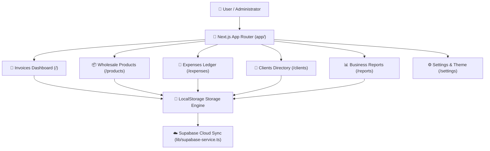
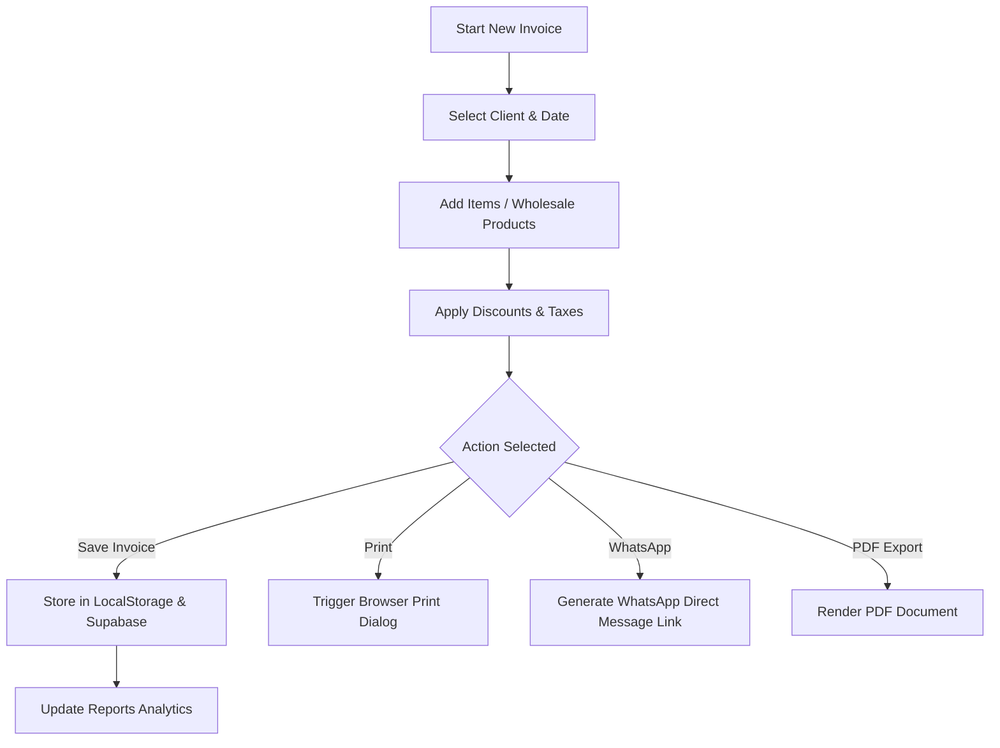
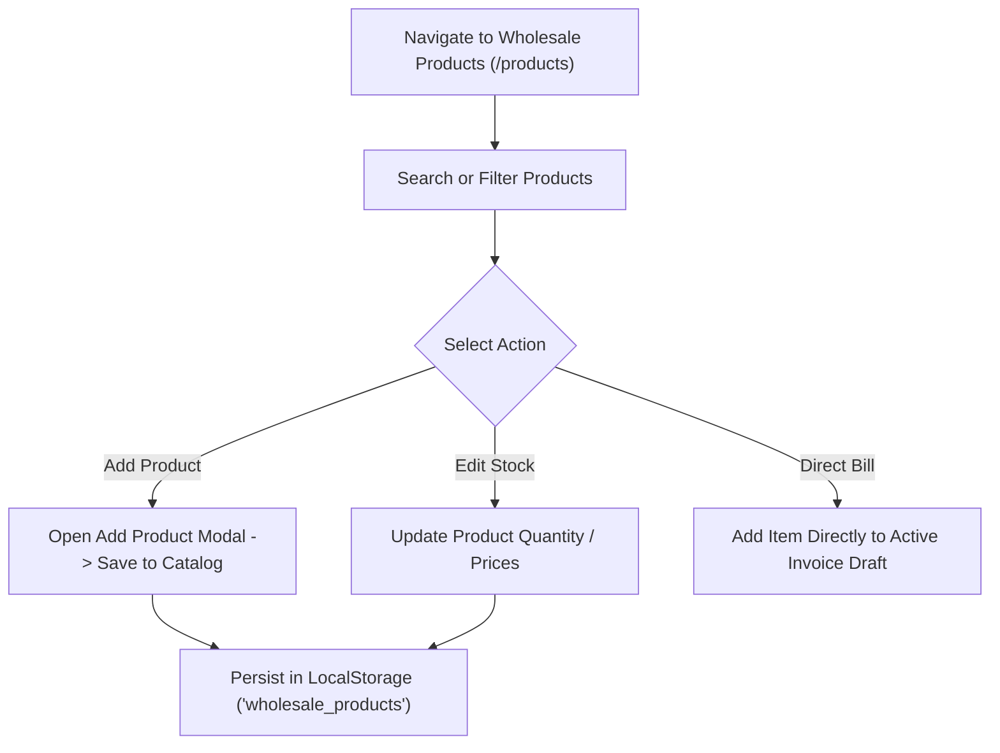
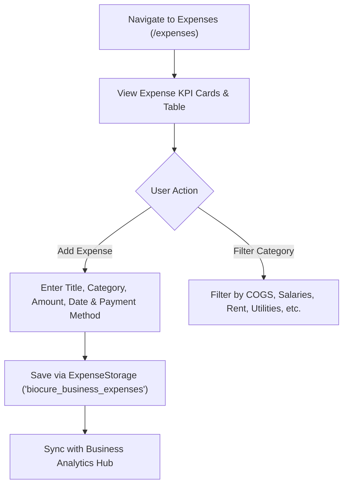
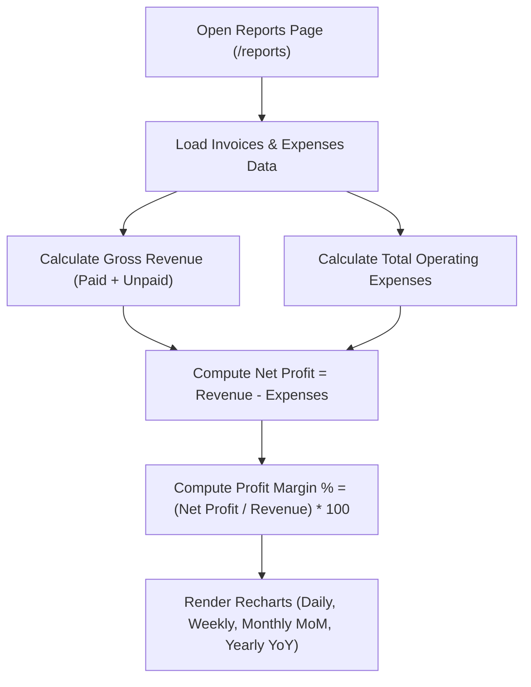
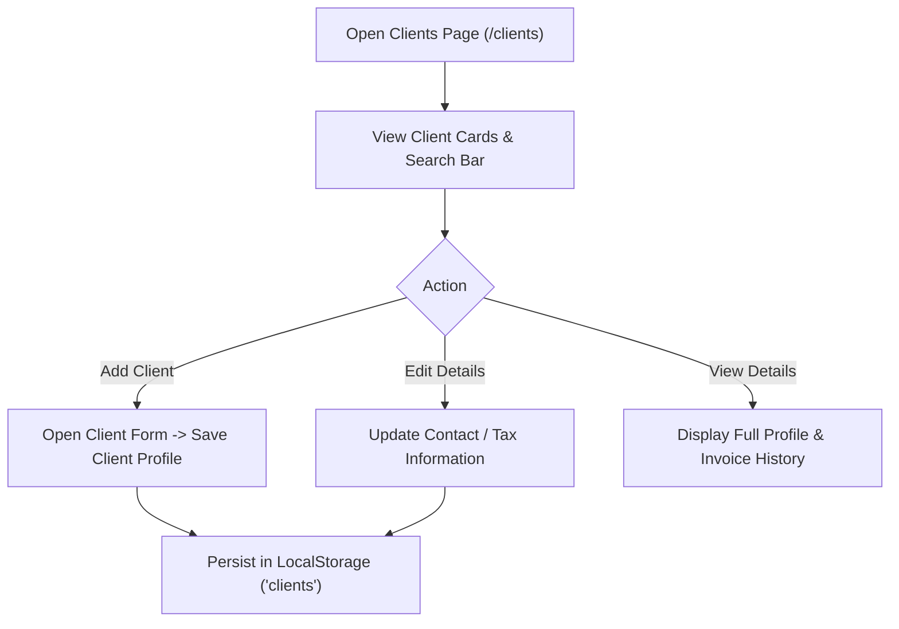
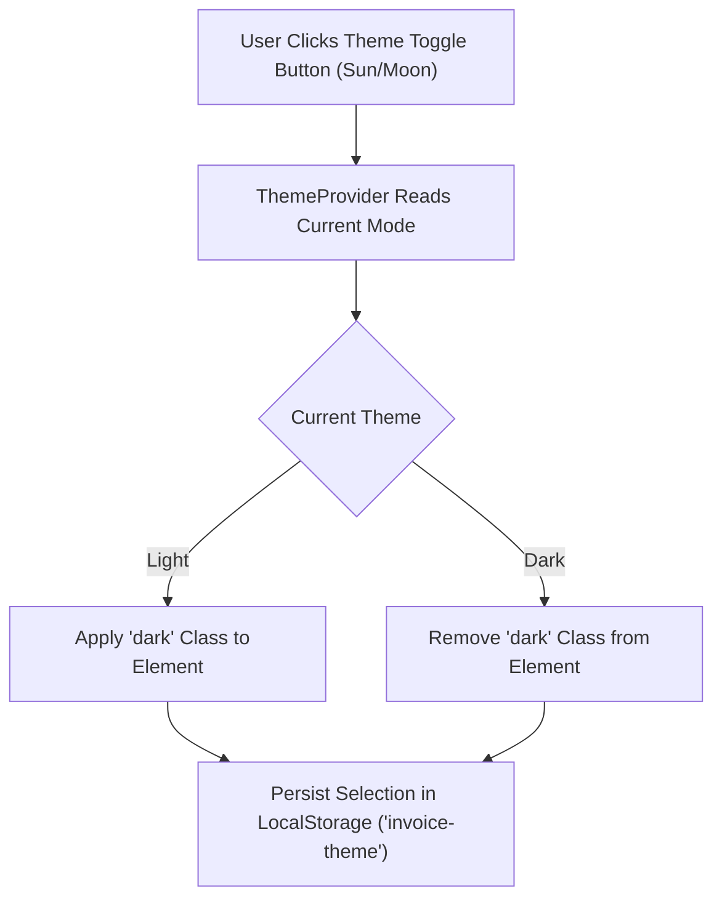

# 🏥 BioCure Healthcare — System Architecture & Workflow Guide

A complete, easy-to-understand developer guide outlining the entire BioCure Healthcare system architecture, core feature workflows, data structures, and step-by-step Mermaid diagrams.

---

## ⚡ Executive Summary & Tech Stack

BioCure Healthcare is an enterprise-grade medical and business management software providing **Invoice Generation**, **Wholesale Product Inventory**, **Expense Tracking**, **Client Directories**, and **Real-Time Financial Reports**.

- **Frontend**: Next.js 14 (App Router), TypeScript, TailwindCSS v4, Lucide Icons
- **State & Theme**: Custom `ThemeProvider` with localStorage persistence and OKLCH Twilight Slate dark mode
- **Data Layer**: LocalStorage (instant offline availability) with fire-and-forget Supabase Cloud synchronization
- **Reports Engine**: Recharts for daily/weekly/monthly/yearly revenue, expenses, and net profit visualization

---

## 🏗️ High-Level System Architecture Diagram



---

## 🔄 Feature Workflows & Step-by-Step Diagrams

### 1. Invoice Generation & Billing Workflow
**Overview**: Create, print, save, duplicate, or share medical invoices via WhatsApp with automatic tax, discount, and grand total calculations.



---

### 2. Wholesale Products & Stock Management
**Overview**: Manage medicine inventory, stock quantities, trade prices, retail prices, and low-stock alerts.



---

### 3. Expenses Ledger & Expense Tracking
**Overview**: Log business purchases (COGS), salaries, office/shop rent, utility bills, and maintenance to determine net operating expenses.



---

### 4. Business Reports & Financial Analytics
**Overview**: Analyze business health through daily, weekly, monthly, and yearly revenue vs. expense charts to calculate **Net Profit** and **Profit Margin %**.



---

### 5. Client Directory Management
**Overview**: Maintain client contact details, business names, addresses, tax IDs, and transaction histories.



---

### 6. Theme Engine & Dark Mode Toggle
**Overview**: Dynamic theme switching between Light mode and a comfortable Twilight Slate dark theme (`#1e293b`).



---

## 🚀 Quick Start for Developers

```bash
# 1. Clone Repository
git clone d:/biocurehealthcare

# 2. Install Dependencies
npm install

# 3. Start Development Server
npm run dev
```

Open [http://localhost:3000](http://localhost:3000) in your browser to start developing!
